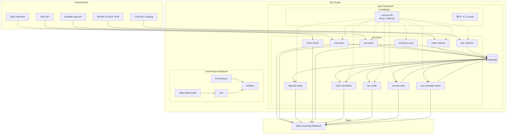
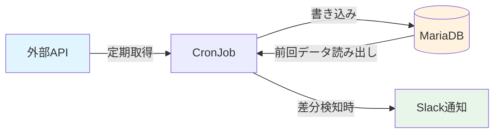

# Mitori アーキテクチャ図

## 全体構成



## データフロー（CronJob 実行サイクル）



## サービス依存関係

```mermaid
graph LR
    subgraph 収集系
        MITC[mitre-collector]
        KEVC[kev-collector]
        EOLW[eol-watch]
        INV[inventory-scan]
        CVE[cve-watch]
    end

    subgraph 分析・通知系
        MITN[mitre-normalizer]
        KEVN[kev-notify]
        CKA[cve-kev-alert]
        COV[cve-coverage-report]
        LIFE[lifecycle-notify]
    end

    MITC -->|raw data| MITN
    KEVC -->|KEV entries| KEVN
    KEVC -->|KEV entries| CKA
    CVE -->|CVE entries| CKA
    INV -->|inventory| CVE
    INV -->|inventory| COV
    EOLW -->|EOL dates| LIFE
```
